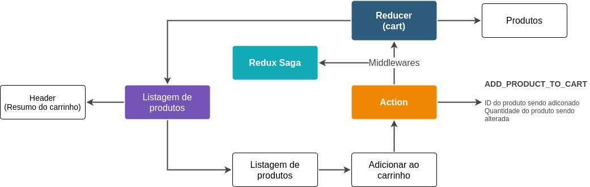

<h1 align="center">
  
</h1>

<h2 align="center">
  Uma demonstração funcional do uso de Redux e Redux Saga
</h2>

  <a href="#sobre-o-projeto">Sobre o projeto</a>&nbsp;&nbsp;&nbsp;|&nbsp;&nbsp;&nbsp;
  <a href="#get-started">Get Started</a>&nbsp;&nbsp;&nbsp;|&nbsp;&nbsp;&nbsp;
  <a href="#licença">Licença</a>

---

## Sobre o projeto
Este projeto contem uma simples demonstração do uso de Redux e Redux Saga. O Redux é uma ferramenta para compartilhar dados entre componentes da aplicação, seu funcionamento é semelhante ao Context Api do React, mas permite trabalhar com a granularidade dos dados de um contexto de forma mais eficiente.

Existem diferentes bibliotecas para trabalhar com contexto no react e em outras aplicações frontend, o Redux é uma dessa bibliotecas, dado o fato desta ser amplamente utilizada pela comunidade, compreender seu funcionamento é muito útil para aplicações empresariais.

Além do Redux, este projeto também demonstra o uso do Redux Saga, essa é uma biblioteca auxiliar para o Redux que permite a construção de middleware para as requisições do reducer. O diagrama abaixo demonstra o modo como esta tecnologia funciona.

  

## Get Started

Para executar essa aplicação é necessário possuir as seguintes dependências em seu ambiente
- nodeJs ^14.15.5

Siga os passos abaixo para executar este projeto em seu computador
- Faça o clone deste repositório para seu ambiente
- Acesse o diretório do repositório por meio do terminal
- Execute o comando `yarn` ou `npm install` para baixar as dependências do projeto
- Execute o comando `yarn server` ou `npm run serve` para executar o backend baseado em json
- Execute o comando `yarn start` ou `npm run start` para iniciar o projeto

## Licença
Esse projeto está sob licença MIT, veja o arquivo de [LICENSE](./LICENSE) para mais detalhes

___
By Mauricio Redmerski André
